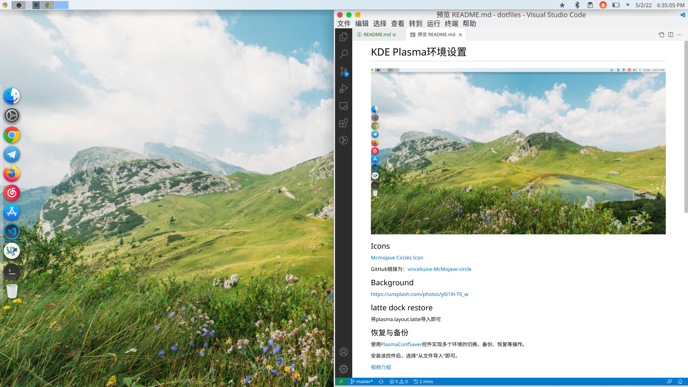

# KDE Plasma环境设置

## 恢复与备份
使用[PlasmaConfSaver](https://github.com/paju1986/PlasmaConfSaver)控件实现多个环境的切换、备份、恢复等操作。

安装该控件后，选择"从文件导入"即可。[视频介绍](https://www.youtube.com/watch?v=D94-LDgGA8o)

**将`dotfiles/assets/kde-plasma-setting/kde-mcmojave-default.tar.gz`文件使用PlasmaConfSaver导入，可以快速设置本环境**，减少下载、配置的麻烦。

## Icons
图标库使用[McmoJave Circles Icon](https://store.kde.org/p/1305429/)，GitHub链接为：[vinceliuice-McMojave-circle](https://github.com/vinceliuice/McMojave-circle)。下载导入，在设置-外观中选择即可。

## Wallpaper
壁纸是自己精心挑选了1小时找到的，个人非常满意，就是文章开头的图片，[链接](https://unsplash.com/photos/y0i1lh-T0_w)

## latte dock restore
将`assets/plasma.layout.latte`文件导入即可。
